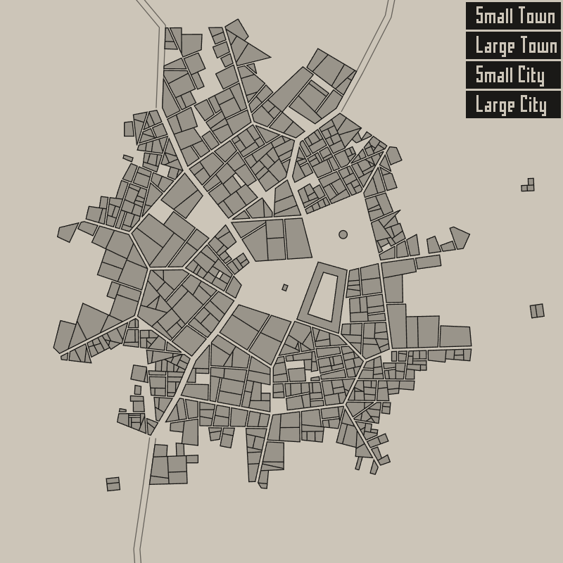

# P1 验收与复现

日期：2026-09-29。结论：**P1 完成，可以进入 P2 算法移植**。

验收环境为 Windows x64，Chrome 153.0.8010.53，800×800 CSS 像素地图视口。本文的通过结论仅覆盖实际运行的 HTML5 / Chrome 环境。

## 交付与验证结果

| 项目 | 结果与证据 |
| --- | --- |
| 原 Haxe 构建 | 保持 64 个参考文件不变，在副本中使用原 OpenFL / Lime / msignal 版本生成 HTML5；原版和阶段观测版均通过 |
| 固定种子基线 | 4 个种子 × 4 个规模，加 2 个无广场样本，共 18 组；每组观测版运行两次，阶段 JSON 完全一致 |
| 观测代码不改变输出 | 每组另运行未修改源码的原版；18 组原版 / 观测版截图完全一致 |
| 阶段数据 | 六阶段快照，含顶点共享 ID、地块、街区用途、几何、道路、墙门和阶段末随机数状态；失败尝试也保留 |
| 旧版视觉 | 保存 18 张 DPR=1 截图，另有 `(12345, 24)` 的 DPR=2 截图；已目视检查城墙、建筑与原位图字体 |
| npm 接入 | OpenFL 9.5.2 + TypeScript + Vite；类型检查、开发服务器、生产打包和生产预览通过 |
| 浏览器验收 | 开发 / 生产 × DPR=1/2，共 4 项 Playwright 测试通过；检查实际像素、双层道路、塔楼、透明区域悬停、缩放和窗口缩放后的命中 |
| 字体验证 | 使用原 `maroubra.png`；`Small Town 12345` 的全部 16 个字形矩形及 59×10 位图布局与 Haxe 输出一致，截图保留视觉证据 |
| 源码完整性 | `verify:upstream` 通过；原许可证与参考内容保持一致 |

结果文件：[旧版报告](../tests/fixtures/p1/legacy/report.json)、[基线目录说明](../tests/fixtures/p1/README.md)、[浏览器报告](../tests/fixtures/p1/playwright-results.json)。

旧版样例（seed=12345、size=24、DPR=1）：



## 锁定的版本

| 工具 / 依赖 | 实际验证版本 |
| --- | --- |
| Node.js / npm | 24.19.0 / 11.17.0 |
| Haxe 编译器 | 3.4.7 |
| Haxelib 管理器 | 4.1.1，来自 Haxe 4.3.7 的官方二进制包 |
| Neko | 2.3.0 |
| 旧版 OpenFL / Lime / msignal | 8.9.0 / 7.3.0 / 1.2.5 |
| npm OpenFL | 9.5.2 |
| TypeScript / Vite | 5.9.3 / 8.3.1 |
| Playwright / pngjs | 1.63.0 / 7.0.0 |
| Chrome | 153.0.8010.53（本机 Chrome，非 Playwright 下载的浏览器） |

npm 依赖使用精确版本，传递依赖保存在 [package-lock.json](../package-lock.json)。旧工具链的官方下载地址和实测 SHA-256 保存在 [toolchain.json](../tools/legacy-harness/toolchain.json)。Haxe 4.3.7 仅提供现代 Haxelib，不用于编译原项目。

## 从检出目录复现

以下命令在本项目根目录执行。npm 示例不需要安装 Haxe；旧版构建脚本目前只覆盖 Windows x64。需要本机已安装 Chrome；系统 Chrome 更新可能改变抗锯齿结果，报告会记录实际版本。

```powershell
npm ci
npm run verify:upstream
npm run build
npm run test:p1
npm run verify:fixtures
```

运行交互示例：

```powershell
npm run dev
# http://127.0.0.1:5173
# 或 npm run preview，在 http://127.0.0.1:4173 查看生产包
```

恢复原版和观测版并复查阶段基线：

```powershell
npm run legacy:setup
npm run legacy:build
npm run legacy:build:instrumented
npm run baseline:verify
```

`legacy:setup` 首次联网下载官方工具链与三项 Haxelib 依赖；下载的工具链归档必须通过 SHA-256 校验。工具只写入本项目 `.tools/`、`.haxelib/`，脚本结束后还原进程 PATH 等环境变量，不要求修改系统安装。

两个 HTML5 输出分别位于 `artifacts/legacy-original/Export/html5/bin/` 和 `artifacts/legacy-instrumented/Export/html5/bin/`。采集程序自动以回环地址启动临时 HTTP 服务，并在结束时关闭服务和浏览器。`baseline:verify` 重新运行 18 组样本，与已保存阶段哈希比较；截图在同一次采集中比较原版 / 观测版，避免把跨浏览器的抗锯齿差异误判成采集改变算法。

全部运行产物写入 `artifacts/`，验收通过并保留在版本管理中的参考数据位于 `tests/fixtures/p1/`。首次已完成基线采集；日常验证不会覆盖这些参考文件。

## 实测兼容问题与处理

1. **Haxe 4 无法编译原 OpenFL 8.9.0 的 `@:fakeEnum`。** 改用官方 Haxe 3.4.7，原源码和三项依赖版本无需修改。[Haxe 3.4.7 官方下载](https://haxe.org/download/version/3.4.7/)
2. **旧版 Haxelib 缺少 `MSVCR120.dll`，曾触发系统弹窗。** 最终脚本优先使用现代 Haxelib 4.1.1，再调用 Haxe 3.4.7 编译器；不会再调用旧版 Haxelib，也未要求安装全局 VC 运行库。
3. **Lime 7.3.0 的原生辅助程序输出 `Could not find NekoAPI interface.`。** 当前 HTML5 构建仍返回 0 并生成可运行产物；所有地图截图和阶段数据均来自这些产物。此诊断已保留为已知工具链限制，没有把原生桌面目标视为通过。构建脚本先移除旧 JS，防止用陈旧产物掩盖构建失败。
4. **OpenFL npm 的 CommonJS 包装会保留额外 `default`。** [openfl.ts](../apps/openfl-probe/src/openfl.ts) 在单独适配边界解包，保持原类型声明，开发与生产均验证。
5. **该 npm 包实际优先创建 WebGL 上下文。** 接入示例明确使用 OpenFL 的 WebGL2 后端；DPR 由 `allowHighDPI` 处理。没有声称已完成原生 Canvas / SVG 渲染器。此选择基于安装包代码和实际浏览器结果；[OpenFL 官方语言说明](https://www.openfl.org/learn/languages/)介绍 npm / Vite 支持。
6. **Vite 对上游 `js/Lib.js` 的 `eval` 和大体积包发出提示。** 生产 JS 约 1.30 MB，gzip 约 273 KB；这些提示未导致运行错误，也未作为性能验收。字体图片约 16 KB。

透明命中区采用原版 `beginFill(0, 0)`，实际鼠标移入 / 移出验证。鼠标测试模拟连续移动；地图缩放与页面尺寸变化后仍使用 CSS 坐标命中。

## 后续边界

尚未实现 `generateTown`、`TownData`、`buildMapScene` 或正式绘制器 API。没有发布 npm 包，没有测量生成性能，也没有验证非 Chrome 浏览器或原生目标。

原算法中的无限重试、旧寻路行为和失败后状态残留没有在 P1 修复。固定样本中最多出现 5 次尝试，原始失败信息包含 `Bad walled area shape!`、`Bad citadel shape!`。观测版只读取模型并复制数据，不消耗随机数；P2 应据此验证移植，再按计划单独处理算法修复与版本变化。
