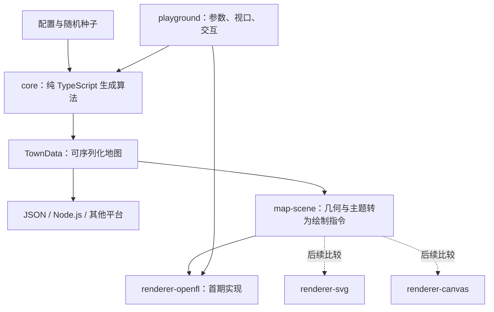

# SettlementMapGenerator 重构方案

日期：2026-09-30。状态：P0–P5 已完成。验收证据见 [P0](P0_ACCEPTANCE.zh-CN.md)、[P1](P1_ACCEPTANCE.zh-CN.md)、[P2](P2_ACCEPTANCE.zh-CN.md) 、[P3](P3_ACCEPTANCE.zh-CN.md) 和 [P4 验收记录](P4_ACCEPTANCE.zh-CN.md)。P5 已根据用户选择采用 Canvas 默认预览、SVG 矢量导出，见 [P5 验收](P5_ACCEPTANCE.zh-CN.md)。

2026-09-30 收尾：已核对下列迁移对象，当前源码树移除了旧版 Haxe 实现与专用构建工具；详见 [迁移核对与源码清理](MIGRATION_COMPLETION.zh-CN.md)。本文涉及旧路径、最初交付和阶段先后顺序的内容用于说明迁移过程，旧代码通过 Git 历史追溯。

## 1. 目标与技术决策

将原 Haxe 应用重构为可独立调用的 TypeScript 城镇生成库，第一版沿用 OpenFL 绘制。生成结果可在浏览器、Node.js 工具中使用，也可通过 JSON 交给其他平台处理。

确定的边界：

1. 算法内核不依赖 OpenFL、DOM、窗口、字体或网络。
2. 首个绘制适配器使用 OpenFL；保留原地图配色、线条、建筑轮廓与图层关系。
3. 后续 SVG、Canvas 消费同一份地图和绘制数据；更换绘制方式不重新生成地图。
4. 初期以原仓库功能为基线。水域、三维建筑、经济模拟、大型交互编辑器不纳入本轮迁移。
5. 第一轮交付是本方案及参考源码；可运行原型、npm 包和性能数据属于后续实施成果。

OpenFL 官方提供包含 TypeScript 类型声明的 npm 版本，适用于 JavaScript / HTML 环境，并支持 Vite 等构建工具。首选路线是 **TypeScript 直接使用 OpenFL npm 包**，而非要求 Haxe 渲染器长期参与 TypeScript 构建。[官方语言支持说明](https://www.openfl.org/learn/languages/)

这里“沿用 OpenFL”指保留绘图库和绘制语义，不表示把旧版 Haxe 文件原封不动放进 TypeScript 工程。原 Haxe 8.9.0 依赖与所选 npm 版本的 API、字体、绘制行为需要单独验证。

OpenFL npm 路线面向 Web 环境，不能据此承诺保留 Haxe 的原生 C++ 等编译目标。其他平台第一阶段通过 JSON 接入；如以后需要原生运行时内嵌算法，再制定语言绑定方案。

## 2. 原项目的迁移对象

下表业务路径相对历史版本的 `legacy/TownGeneratorOS/Source/com/watabou/towngenerator/`；`geom/`、`coogee/`、`utils/` 位于其上一级 `com/watabou/` 中。实际完成的模块位置见迁移核对记录。

| 原模块 | 当前责任 | 目标位置 |
| --- | --- | --- |
| `building/Model.hx` | 整个生成流程、全局实例、街区分配 | `core/generator` 的流程与上下文 |
| `building/Patch.hx` | 地块及所属街区 | `core/model` 的拓扑与数据 |
| `geom/*`、`building/Cutter.hx` | 多边形与图算法 | `core/geometry` |
| `building/Topology.hx`、`CurtainWall.hx` | 道路、边界、城门、城墙 | `core/generator` 的独立阶段 |
| `wards/*` | 用途评分和建筑生成 | `core/wards` 的注册策略 |
| `mapping/CityMap.hx`、`Brush.hx`、`Palette.hx` | 绘制顺序、样式、图形操作 | `map-scene` 与 `renderer-openfl` |
| `mapping/PatchView.hx`、`ui/*` | 悬停、按钮和提示 | `apps/playground` 与绘制适配器 |
| `Main.hx`、`TownScene.hx`、`StateManager.hx` | 启动、布局、URL 状态 | `apps/playground` |
| `coogee/*`、`utils/*` | 通用框架和工具 | 按实际依赖移植，不整体照搬 |

当前核心顺序为：地块 → 交点优化 → 城墙 → 道路 → 街区用途 → 建筑几何。先保留这个顺序，避免同时改变算法和工程结构。

## 3. 目标架构



P2 已建立 `packages/core/src`，按以下职责使用独立 `.ts` 模块（geometry、voronoi、cutter、context、model、topology、generator、options、wards、types、export、serialization）。P3 已完成 map-scene、renderer-openfl 和 playground；下图表达职责划分，实际模块采用少量平铺 `.ts` 文件。P1 接入实验保留在 `apps/openfl-probe`：

```text
packages/
  core/src/
    geometry/       # Point、Polygon、Voronoi、图搜索
    random/         # 每次生成独立的随机数状态
    model/          # 顶点、地块、道路、建筑、城墙
    generator/      # 流水线、校验、重试
    wards/          # 用途评分和建筑生成策略
    serialization/ # DTO 转换和版本校验
  map-scene/src/    # 有序绘制指令、主题、世界坐标命中区域
  renderer-openfl/src/
apps/
  playground/      # 浏览器预览；独立于库
tests/
  fixtures/        # 固定种子、阶段输出与视觉参考
  integration/
assets/fonts/       # 仍在使用的上游字体资源
docs/
```

采用 npm workspaces 管理少量包。P2 核心包已导出 ESM 和 TypeScript 声明；CommonJS 按消费方实际需要再增加。P1 已验证 Vite 接入，精确版本和 lockfile 已保存。根包与示例标记为 private，首期不执行 npm 发布。

依赖方向必须保持单向：`core` 不导入 `map-scene` 或绘制适配器。安装和导入核心包不会加载 OpenFL，测试必须在没有 `window` / `document` 的 Node.js 进程中通过。

## 4. 数据与算法改造

### 4.1 生成上下文

以 `GenerationContext` 替代 `Model.instance` 和静态 `Random`，包含配置、实例随机数、内部拓扑、阶段计数和错误信息。URL、当前窗口和系统时间不进入确定性生成路径。

`seed` 必填。预览界面负责生成新种子并展示给用户；库只接收明确输入。初期保留原伪随机公式和调用顺序，新增可选特征时记录实际解析出的配置。

### 4.2 共享顶点与序列化

旧代码依赖共享的可变 `Point` 对象；`Polygon.contains()` 在许多调用处表示“包含同一个顶点”，并不表示几何上的点在多边形内。

迁移第一步保留共享对象语义，并为顶点分配稳定 ID。后续将邻接、墙门引用和跨区域连接改为显式 ID。对外 DTO 使用顶点表与 ID 引用，不输出 Haxe / OpenFL 类实例、Map、函数或循环引用。

将 `hasVertexId()` 和 `containsPoint()` 分成不同方法。不能把两个坐标恰好相同的独立顶点自动视为同一个拓扑节点，也不能把共享顶点全部深拷贝成断开的节点。

### 4.3 规则与几何

拆出 `buildPatches`、`optimizeJunctions`、`buildWalls`、`buildStreets`、`assignWards`、`buildBuildings`，由一个明确流程调用。街区注册表提供 ID、选址评分与几何生成策略，替代 `Reflect.field` / `Type.createInstance` 的动态发现方式。

初期不同时替换 Voronoi、多边形切割和随机数库。优先获得可对照的移植结果，再评估是否使用第三方几何库；引入新算法需要单独的版本与测试记录。

### 4.4 兼容性与错误

`schemaVersion` 描述数据格式；`generatorVersion` 描述生成算法；包版本描述软件发布。它们分别管理。

可复现的范围是：同一生成器版本、规范化配置与种子、同一 JS 运行环境中获得稳定输出。跨版本或跨 JS 引擎不默认承诺同一个种子对应逐位相同的地图。P2 已发现 Node / Chrome 三角函数末位差异会改变部分建筑切割，并在验收记录中保留证据；跨环境共享同一地图使用 JSON。同 Chrome 环境的旧版 18 组全部阶段精确一致；P3 绘制另以固定旧版数据和 DPR 1/2 截图完成验收，范围与容差见 [P3 验收记录](P3_ACCEPTANCE.zh-CN.md)。

配置校验失败直接返回错误；可恢复的几何失败最多尝试 `maxAttempts` 次。第一版草案默认 20 次，另设切割深度与几何数量上限，避免单次尝试中的递归不终止。重试继续使用该次调用的局部随机流，保留阶段和尝试次数。

原 `Graph.aStar()` 未按最低代价取节点，也没有启发式；迁移对照阶段保留其行为并注明。P4 已将其替换为经独立图用例验证的 Dijkstra，并升级 `generatorVersion` 为 `0.4.0`；FIFO 仅保留在测试工具中。

## 5. OpenFL 保留与可替换绘制

### 5.1 第一阶段 OpenFL 接入实验

先在独立最小示例中验证 npm 版本的导入、类型声明、开发运行和生产打包。覆盖多边形填色、双层道路描边、城墙、圆形塔楼、透明命中区域、字体、窗口缩放及 DPR=1/2。

沿用 `Assets/maroubra.png` 作为字体视觉参考，确认现有位图字体布局能否迁移；不得把换成系统字体后产生的差异误归因于几何算法。主绘制器只需图形指令，提示文字可由示例界面管理。

如果 npm 接入实验不通过，先在最小复现中定位版本或打包问题。必要时临时以 Haxe 编译后的 OpenFL 查看器读取 JSON，保证内核与数据协议不受影响；该桥接路线属于备用实施方案，不是本次已实现能力。

### 5.2 渲染无关的绘制指令

`buildMapScene(town, theme)` 将地图转换成有序的 polygon / polyline / circle 指令，以及独立的命中区域。主题控制颜色、线宽、道路宽度和图层样式。

序列顺序必须保留：原实现有先描边再填充、不同宽度线条叠加等行为。不能简单按“建筑类型”重排，导致城墙、道路或建筑覆盖关系改变。

统一定义世界坐标、视口变换、线宽单位、闭合规则、线帽和拐角连接。对传统双向顶点共享造成的形状变化，在生成结束前完成；绘制器不得修改地图或消费随机数。

OpenFL 适配器负责 Stage / Sprite / Graphics、尺寸与 DPR、事件监听、命中测试桥接和资源释放。公共返回值不暴露 Sprite；销毁接口必须解除监听器并移除挂载元素。

## 6. 分阶段交付与验收

| 阶段 | 工作内容 | 可检查的交付物与完成条件 |
| --- | --- | --- |
| P0：方案与参考源码 | 已完成（2026-09-29） | 方案、接口草案、上游哈希、64 个参考文件与许可证已核对；离线校验通过，未运行项见验收记录 |
| P1：可复现基线 | 已完成（2026-09-29） | 原 Haxe HTML5 构建通过；18 组阶段数据和 19 张旧版截图；OpenFL 开发 / 生产 × DPR=1/2 的 4 项浏览器测试通过；版本已锁定 |
| P2：纯算法库 | 已完成（2026-09-29） | core ESM/类型声明；43 项 Node 测试通过；同 Chrome 的 18 组旧版阶段精确一致；JSON 引用与交错状态隔离通过，跨引擎浮点边界已记录 |
| P3：OpenFL 地图预览 | 已完成（2026-09-29） | 绘制指令/适配器/真实预览；参数与 URL、悬停、主题、视口及 JSON；6 项场景测试和 16 项浏览器测试通过，旧版与固定数据截图对照通过 |
| P4：稳定性与库交付 | 已完成（2026-09-30） | Dijkstra 与算法版本 0.4.0；57 项 Node、24 项浏览器测试；620 组批量报告；Worker 取消/超时；DPR 1/2 各 40 次资源循环；独立压缩包消费、无 OpenFL 的 core 依赖图 |
| P5：绘制器评估 | 已完成（2026-09-30） | Canvas/SVG 最小包、六组并排样本与细节镜头、54 组截图/性能记录；用户已选择 Canvas 默认预览、SVG 矢量导出，OpenFL 保留对照 |

P1 的接入实验通过后再展开批量移植，避免完整重写后才发现 OpenFL npm 兼容问题。每个阶段单独提交，结构迁移与改变地图输出的算法修复分开。

P1 已运行种子 `1`、`42`、`12345`、`682063530` 与规模 `6`、`15`、`24`、`40` 的 16 组组合，并补充 `(22245, 6)`、`(30000, 40)` 两个无广场样本。18 组均可重复生成，重试中的失败阶段也已保存；后续继续补充退化输入与显式开关边界。

如果旧版不能在合理兼容调整后稳定运行，应记录构建阻碍，并把几何不变量与人工检查作为暂时基线；没有旧版对照数据时不得宣称“完全复刻”。

## 7. 验证重点

- 几何：有限坐标、有效多边形面积、切割面积关系、退化边和数值容差；建筑不越出所属地块。
- 拓扑：共享边与顶点一致、引用存在、城门连接可通达、JSON 往返后的邻接关系不丢失。
- 确定性：同配置种子重复运行、并行隔离；规范化序列化后比较结果，时间统计不参与地图哈希。
- 可靠性：输入越界、切割深度、重试预算、无可用路径时有限时间内结束；区分预期生成失败和程序异常。
- 视觉：固定地图数据、固定视口与主题，检查道路线宽、墙门覆盖、字体和悬停区域；图像差异允许抗锯齿容差并辅以人工检查。
- 包边界：从实际打包产物导入，核心包不触碰浏览器全局变量；绘制器多次创建、销毁后不残留事件监听。

每阶段只运行与改动相关的验证。P1 已采用并锁定 Playwright 浏览器测试工具；P2 使用 Node 原生 test runner 验证算法，复用 Playwright 对照同浏览器下的旧版阶段。

## 8. 后续如何比较 SVG 与 Canvas

OpenFL、SVG 和 Canvas 的视觉质量取决于几何、样式与实现，不能提前认定其中一个必然更好。SVG 描述二维矢量图形；Canvas 提供脚本绘图能力，差异应结合本项目的实际图量和交互测量。[SVG 文档](https://developer.mozilla.org/en-US/docs/Web/SVG)、[Canvas 文档](https://developer.mozilla.org/en-US/docs/Web/API/Canvas_API)

固定同一批地图数据，不让三个渲染器分别生成地图。使用同一机器和浏览器，固定 800×800 CSS 像素视口，DPR=1/2，缩放 0.5× / 1× / 4×，预热后重复测量。

| 维度 | 检查方式 |
| --- | --- |
| 外观 | 道路留白、建筑边缘、城墙拐角、塔楼、字体、不同缩放下的清晰度 |
| 绘制耗时 | 单独测首次显示、重绘和视口交互的中位数 / P95；生成耗时独立报告 |
| 交互 | 悬停命中准确性、缩放和平移延迟 |
| 内存 | 多次重新绘制与销毁后的趋势 |
| 导出 | 用户需要的位图或矢量输出、尺寸、字体与样式一致性 |
| 工程成本 | 依赖体积、实现复杂度、浏览器兼容与维护工作 |

保留表现最合适的方案；如“交互预览”和“矢量导出”需求不同，可以分配给不同适配器。首期不同时实现三个绘制器。

## 9. P0 时的已知状态（历史记录）

以下保留初始环境记录，P1 实施后的状态以 [P1 验收记录](P1_ACCEPTANCE.zh-CN.md) 为准。

- 新仓库已有 `main` 初始提交，原历史保留。
- 参考源码固定在上游提交 `7fbc87a9398cc508af24de93f79cf2ad027f352b`。
- 原项目 GPL v3 许可证文本与作者来源随参考源码保留。
- 当前检查中 Node.js / npm 可找到，Haxe / haxelib 不在 PATH；没有执行旧版构建。
- OpenFL TypeScript 支持已根据官方资料核实；具体 npm 版本的构建和视觉兼容性仍需 P1 实测。
- 本次只提交方案、接口草案和参考源码；没有可运行的新地图预览，也没有声称性能或截图验收已完成。
